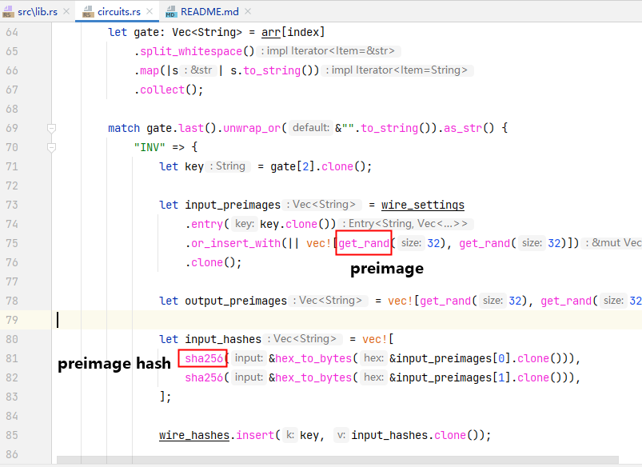

# taproot-txs


## usage
Provide a circuit in bristol format, and you can generate the corresponding taproot address.
One transaction is a bitcommitment transaction, while the other is a verification
transaction. For testing, it use the circuit from the yellow paper as an example.

## Introduction to each section

| name | description |
| -------- | -------- |
| lib.rs  | Overall test cases. |
| bitcommitmenttx.rs  | Generate bit commitments transaction and address. |
| circuits.rs  | Convert the circuit into a list of operations such as wires and gates. Generate preimages and preimage hashes for all wires. |
| gate_templates.rs  | Template scripts for gates, used to replace the preimage hash to generate the leaves of the verification transaction.|
| timelock.rs  | Generate time lock scripts for other 2 taproot transactions. |
| utils.rs  | Some general gadgets: sha256 rand xor inv and.  |
| verificationtx  | Generate verification transaction and address |

For specific details, please refer to the Yellow Paper.


## run test
```shell
cargo test --release test_savm_taproot_tx_creation
```

## case in Yellow Paper

As shown in the figure, this is the logic gate circuit diagram in the yellow paper. The code testing case will use this as
input to generate on-chain verification transactions.


This is its corresponding circuit in the Bristol form.

```
4 7
1 3
1 1

1 1 0 1 INV
2 1 1 3 4 AND
1 1 4 5 INV
2 1 2 5 6 AND
```

According to the Yellow Paper, next step is to take the parsed data and process each wire as follows.


First, generate a corresponding random number preimage for each wire, then use sha256 to generate the preimage hash.


use `generate_bit_commitments` and `generate_bit_commitments` separate out the preimagehashs and preimages.

Then, using the operations_array and preimagehash data, along with script templates(`gate_templates.rs`), create all leaf scripts, then place them into taproot to generate a 2-input taproot transaction.

